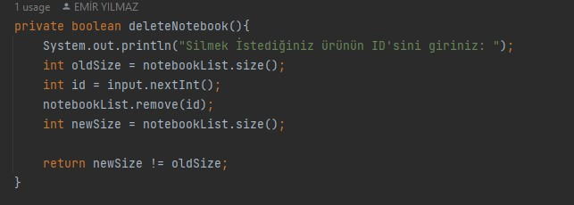
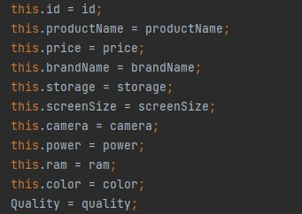
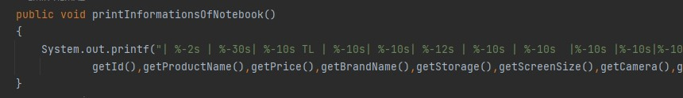

### Patika Store 

#### Proje detayları ve ana hatlar

Projede bir web sitesine ait sabit markalar ve Belirli ürünler
bulunmaktadır amacımız SOLİD Kuralları çerçevesinde bu ürünlere 
işlemler yapmaktır
Projenin detaylarına ve önemli kısımlara bakalım
---

---

---
#### Sınıflar  sınıflara ait detaylar ve önemli noktalar


---
1) ```
   BaseManagementPanel Sınıfı ve detayları
   ```
   ```
   İlgli sınıfın yorum satırlarında anlatılacak olan 
   detaylardan hallice bir detayı yoktur
   Asıl oluşturuluş sebebi Diğer Management sınıflarını
   kontrol eden bir management sınıfı oluşturup
   solid kuralları gereğince yeni bir management sınıfı 
   ürettiğinizde(örn: TelevisionManagement)
   bir sınıfın işlevi değişmesin kodlar 
   minimum değişiklik yapsın ve kolayca projeye yeni bir 
   management ekleyebilelim diyedir
   ```
 ---
 2) ```
    NotebookManegement  Sınıfı ve 
    PhoneManagement Sınıfı detayları
    ```
    ```
    Bu iki sınıf ile ilgili ürünlere ait işlemler yapılmaktadır
    PhoneManagement-->Phone
    NotebookManagement-->Notebook
    yukarıda görüldüğü üzere İlgili sınıfların işlemleri
    Yukarıdaki kontrol panel sınıfları üzerinden gerçekleşir
    Böylece yeni bir ürün eklendiğinde(örn: TelevisionManagement)
    Solid kuralları kapsamında o sınıfa ait işlemler
    buradan yönetilerek bağımlılık azalacak ve işleyiş
    değişmeden o sınıfa ait işlemler burada yönetilecektir
    Örneğin Telefon listesine eklenen bir telefonun
    PhoneManagement paneli üzerinden silinmesini sağlayacak
    Kodun resmi:
    ```
    
---
3) ```
   Notebook Sınıfı ve Phone sınıfı  detayları
   ```
   ```
   Bu sınıflarda ise sadece ürüne ait özellikler,constructor,
   eklenen ürün bilgileri metodu,getter ve setter 
   metotları olacak bu sayede Management sınıfından
   yeni bir ürün eklemek daha rahat ve daha kolay şekilde olacaktır
   Böylece hiçbir sınıfın işlevi değişmeden Solid kuralları gereği
   daha anlaşılır ve kullanışlı bir proje oluşturulacaktır 
   ve bu nedenle yeni bir ürün eklendiğinde (bkz: television)
   managment sınıfına daha kullanışlı şekilde bağlanacak ve 
   Solid kuralları çerçevesinde herhangi bir sınıfın işleyişini
   değiştirmeden yeni bir ürün oluşturabileceğiz
   Bu sınıflara ait işleyiş kodlarının resimleri: 
   ```
   
   Ürünün oluşturucu metodu

   
    Ürünün bilgilerini getiren metot
 ---
4) ```
   Brand sınıfı ve detayları
   ```
   ```
   Bu sınıf ise diğer sınıflardan bağımsız olarak marka adlarını
   taşımaktadır bu yüzden bu sınıtaki kodlar Solid kuralları gereği
   bağımsız kodlar taşıdığından kendisine ait bir olgu taşıdığından
   yeni bir nesne oluşturması yeni bir yapı oluşturması gerekir 
   bu sebepten ötürü bu sınıfımız sadece marka adlarının listeleneceği 
   bir metodu taşır böylece yeni bir marka eklediğimiz zaman
   Solid kuralları gereğince hiçbir kodu değiştirmeyeceğiz sadece 
   ilgili sınıfımıza markamızı ilave edeceğiz bu sebepten ötürü
   projemiz daha kullanışlı ve işlevli olacaktır
   ```
 ---

  **Yukarıda anlatıldığı gibi projedeki sınıfların hepsi ayrı bir 
  olgu yani ayrı bir nesneyi ifade eder böylece projemiz hem clean code
  prensipleri hemde solid prensiplerine uyarken daha temiz ve okunaklı
  yazılarak her sınıfa kendisine ait işleyiş belirtilerek yapılmış olup
  ana amacına SOLİD kurallarınca bağlanır***
  ---

  ---

  ---
  ##  With: 


